<!-- _class: lead -->


# Σχολή Πολιτικών Μηχανικών
## Προγραμματισμός και Θέματα Τεχνητής Νοημοσύνης

**Καθ. Νίκος Λαγαρός** (nlagaros@central.ntua.gr)
**Δρ. Αθανάσιος Στάμος ΕΔΙΠ** (stamthan@central.ntua.gr)
**Μάρκος Καραμπάτσης ΕΔΙΠ** (marka@mail.ntua.gr)


---

<!-- _class: rest -->

# Τι είναι το Internet;

<div class="container">

Είναι το συνολικό δίκτυο των δικτύων που ενώνει μεταξύ τους όλες τις συσκευές που υπάρχουν


</div>

---

<!-- _class: rest -->

# Internet Basics

<div class="container">

**ARPANET**
- Advanced Research Projects Agency Network
- Ιδρύθηκε το 1958 για R&D σχετικά με την επέκταση των ορίων της επιστήμης και της τεχνολογίας
- Μέχρι τότε οι υπολογιστές ήταν μονόλιθοι που δεν επικοινωνούσαν μεταξύ τους
- Συνέλαβαν τότε την ιδέα της δικτύωσης


</div>

---

<!-- _class: rest -->

# Internet Basics

<div class="container">

**Πρωτόκολλα επικοινωνιών**
- Transmission Control Protocol (TCP): σπάει τα δεδομένα σε πακέτα για αποστολή και συναρμολόγηση στον προορισμό
- Internet Protocol (IP): χειρίζεται τη μορφοποίηση και διευθυνσιοδότηση των πακέτων δεδομένων
- Κάθε δικτυακή συσκευή χρειάζεται μια μοναδική IP διεύθυνση


</div>

---

<!-- _class: rest -->

# World Wide Web

<div class="container">

- Εφευρέθηκε από τον Tim Berners-Lee το 1989
- Δημιούργησε τις 3 βασικές τεχνολογίες που διαμόρφωσαν το World Wide Web
- Hypertext Transfer Protocol (HTTP) για την ανάκτηση κειμένου μέσω υπερσυνδέσμων
- Uniform Resource Identifier (URI) που είναι το μοναδικό αναγνωριστικό κάθε οντότητας στο web
- Hypertext Markup Language (HTML) για τη δόμηση και παρουσίαση περιεχομένου στο web


</div>

---

<!-- _class: rest -->

# Πελάτες & Εξυπηρετητές (Clients & Servers)

<div class="container">

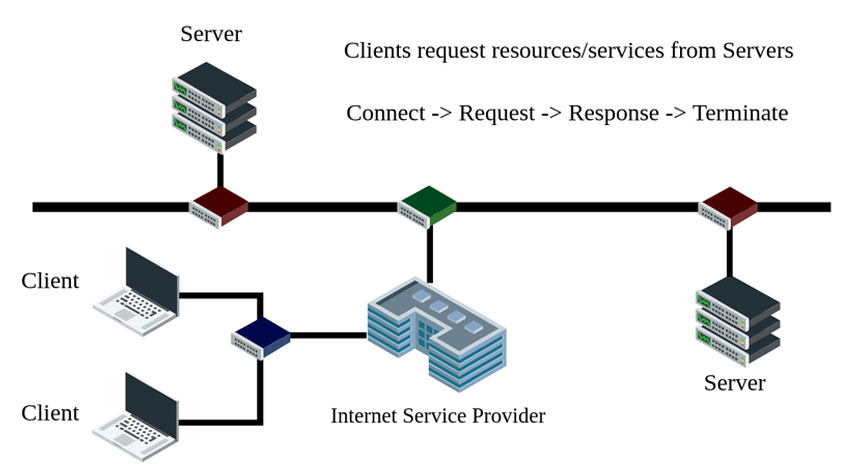

</div>

---

<!-- _class: rest -->

# Από τον εξυπηρετητή στον browser

<div class="container">

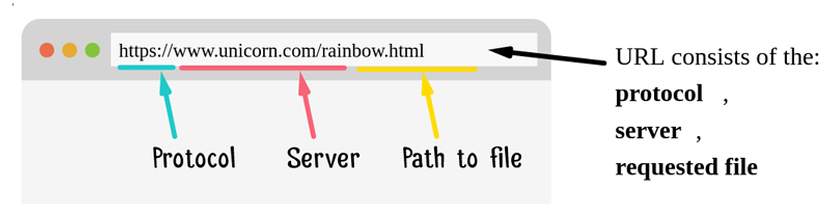

</div>

---

<!-- _class: rest -->

# Το μοντέλο Request Response

<div class="container">

- Ο εξυπηρετήτής στέλνει ένα αρχείο στο φυλλομετρητή και αυτός το παρουσιάζει
- Ο εξυπηρετητής στέλνει πίσω τη ζητούμενη σελίδα και ο φυλλομετρητής αντικαθιστά την τρέχουσα σελίδα με το νέο αρχείο

<div class="columns">
<div>

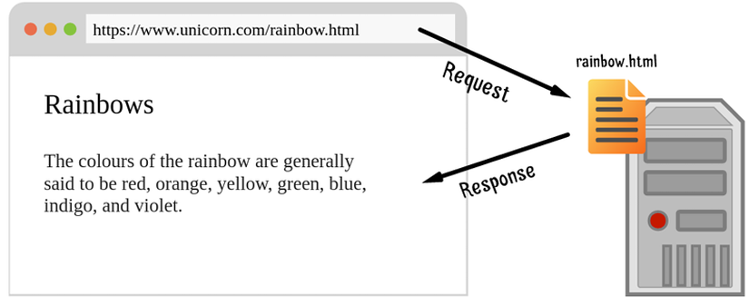

</div>
<div>

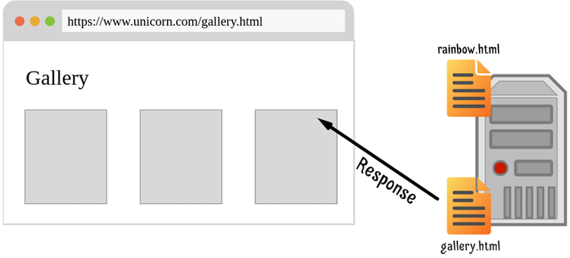
</div>
</div>
</div>

---

<!-- _class: rest -->

# Ποια είναι η δουλειά του web server;

<div class="container">


- Ακούει και δέχεται εισερχόμενες αιτήσεις (request) HTTP.
- Αναλύει το αίτημα και το επεξεργάζεται.
- Στέλνει πίσω μια σωστά διαμορφωμένη HTTP απόκριση (response).


</div>

---
<!-- _class: rest -->

# HTTP requests

<div class="container">

**GET**: χρησιμοποιείται για την ανάγνωση/ανάκτηση δεδομένων από έναν web server. Το GET επιστρέφει έναν κωδικό κατάστασης HTTP 200 (OK) εάν τα δεδομένα ανακτηθούν με επιτυχία από τον web server.

**Μέθοδος GET με query string parameters**
- Ζεύγη κλειδιών/τιμών που αποτελούν μέρος της διεύθυνσης URL, 
`https://www.example.com/index.html?name1=value1&name2=value2`

**Μέθοδος GET με query path parameters**
- Οι τιμές είναι μέρος του url path 
`https://www.example.com/index.html/value1/value2`

</div>

---
<!-- _class: rest -->

# HTTP requests

<div class="container">

**POST**: χρησιμοποιείται για την αποστολή δεδομένων (αρχείο, δεδομένα φόρμας κ.λπ.) στον web server. Με την επιτυχή δημιουργία, επιστρέφει έναν κωδικό κατάστασης HTTP 201

**PUT**: χρησιμοποιείται για την τροποποίηση των δεδομένων στον web server. Αντικαθιστά ολόκληρο το περιεχόμενο σε μια συγκεκριμένη τοποθεσία με δεδομένα που διαβιβάζονται στο body του request. Εάν δεν υπάρχουν πόροι που να ταιριάζουν με το αίτημα, θα δημιουργήσει έναν.

</div>

---
<!-- _class: rest -->

# HTTP requests

<div class="container">

**PATCH**: είναι παρόμοιο με το αίτημα PUT, αλλά η μόνη διαφορά είναι ότι τροποποιεί ένα μέρος των δεδομένων. Θα αντικαταστήσει μόνο το περιεχόμενο που θέλετε να ενημερώσετε

**DELETE**: χρησιμοποιείται για τη διαγραφή των δεδομένων στον web server.
</div>

---

<!-- _class: rest -->

# Εισαγωγή στην HTML

<div class="container">

<div class="columns">
<div>

- Η **HTML** είναι το ακρωνύμιο των λέξεων **HyperText Markup Language**, δηλαδή Γλώσσα Χαρακτηρισμού Υπερ-Κειμένου

- Δεν είναι μια γλώσσα προγραμματισμού αλλά μια **περιγραφική γλώσσα**, δηλαδή ένας ειδικός τρόπος γραφής κειμένου. 

</div>
<div>


</div>
</div>

- Oρίζει ένα σύνολο **κοινών στυλ** για τις Web σελίδες, όπως **τίτλοι** (titles), **επικεφαλίδες** (headings), **παράγραφοι** (paragraphs), **λίστες** (lists) και **πίνακες** (tables). 

</div>

---

<!-- _class: rest -->

# HTML5

<div class="container">

- Η **HTML5** είναι η τελευταία έκδοση της γλώσσας HTML, χρησιμοποιείται και στη δημιουργία εφαρμογών για φορητές συσκευές. 

- H **HTML5** προσθέτει **νέα χαρακτηριστικά** δομής και σύνταξης όπως στη σημασιολογία των ετικετών

- Νέες ετικέτες για σημασιολογικό διαχωρισμό των μερών του εγγράφου, όπως οι **header, section, article και nav**.


</div>

---

<!-- _class: rest -->

# HTML5

<div class="container">

- **Εμπλουτισμένα στοιχεία για φόρμες** (όπως ημερομηνίες, ηλεκτρονικές διευθύνσεις, εύρος τιμών), ενσωματωμένη διαχείριση διανυσματικών γραφικών μορφής SVG.

- Νέες ετικέτες για εισαγωγή ήχου και βίντεο, τις **audio** και **video** αντίστοιχα.

- Νέες δυνατότητες σχεδίασης (**canvas**), μεταφοράς και απόθεσης (**drag-and-drop**), αποθήκευσης απλών δεδομένων (**web storage**) και λειτουργίας εκτός σύνδεσης (**offline web applications**).

</div>

---

<!-- _class: rest -->

# Τι είναι η HTML

<div class="container">

- Η **HTML** αποτελείται από ένα σύνολο **ετικετών (tags)** με τις οποίες **ορίζονται τόσο η δομή του κειμένου όσο και στοιχεία μορφοποίησης**. 
- Οι ετικέτες εμφανίζονται **κατά ζεύγη**. 
- Η πρώτη οροθετεί την αρχή ισχύος της και η δεύτερη το τέλος. 
- Για ορισμένες ετικέτες, το δεύτερο μέλος του ζεύγους μπορεί να παραλειφθεί. Η γενική μορφή είναι: 
`<tag "πιθανές παράμετροι"> κείμενο... </tag>` 
- Για να δημιουργηθεί ένα **αρχείο html**, αρκεί ένα αρχείο απλού κειμένου, το οποίο θα έχει κατάληξη **.html** ή **.htm** και το αρχείο αυτό να περιέχει τις επιθυμητές εντολές με τις ανάλογες παραμέτρους τους.

</div>

---

<!-- _class: rest -->

# Δομή HTML

<div class="container">

<div class="columns">
<div>

- `<HTML>...<⁄HTML>`: Ορίζει την αρχή και το τέλος μιας ιστοσελίδας.
- `<!DOCTYPE html>`: Ορίζει ότι η σελίδα μας είναι HTML5
</div>
<div>

```html
<!DOCTYPE html>
<html lang="en">
<head>
    <meta charset="UTF-8">
    <meta name="viewport" content="width=device-width, initial-scale=1.0">
    <meta name="title" content="Vincent van Gogh's early life">
    <meta name="description" content="Early life of van Gogh as a budding painter">
    <meta name="keywords" content="Vincent, van Gogh, Dutch, painter, young, early life">
    <title>Document</title>
</head>
<body>
  <p>Hello World</p>
</body>
</html>
```

</div>
</div>

- `<HEAD>...<⁄HEAD>`:	Ορίζει το τμήμα εκείνο της ιστοσελίδας στο οποίο αναφέρονται διαχειριστικής φύσεως πληροφορίες που αφορούν στο περιεχόμενο της ιστοσελίδας. Οι πληροφορίες αυτές δεν εμφανίζονται από τον φυλλομετρητή.
- `<BODY>...<⁄BODY>`:	Ορίζει το περιεχόμενο της ιστοσελίδας.

</div>

---

<!-- _class: rest -->

# Meta tags

<div class="container">

- `<meta charset="UTF-8">`: Ορίζει ότι η σελίδα μας έχει κωδικοποίηση UTF-8
- `<meta name="viewport" ...`: Ορίζει ότι η σελίδα μπορεί να προσαρμοστεί ανάλογα με την οθόνη
  - **width=device-width**: Ορίζει το πλάτος της σελίδας ανάλογα με τη συσκευή ανάγνωσης
  - **initial-scale=1.0**: Ορίζει το αρχικό zoom level σε 100% όταν φορτωθεί η σελίδα.
- `<meta name="title" ...`¨: Τίτλος σελίδα
- `<meta name="description" ... `: Σύντομη περιγραφή σελίδας
- `<meta name="keywords"...`: Λέξεις κλειδιά για μηχανές ανάζήτησεις

</div>

---

<!-- _class: rest -->

# Ετικέτες (tags)

<div class="container">

Τα αρχεία της HTML περιέχουν τα ακόλουθα :

- Το κείμενο της ιστοσελίδας.
- Τις ετικέτες της HTML, που υποδεικνύουν τα στοιχεία, τη δομή και τη μορφοποίηση των ιστοσελίδων, τους συνδέσμους υπερ-κειμένου προς άλλες ιστοσελίδες ή προς αρχεία άλλων μορφών (πολυμέσα) και άλλα.
- Οι περισσότερες ετικέτες της HTML εμφανίζονται **κατά ζεύγη**, όπου η πρώτη οριοθετεί την αρχή ισχύος της, ενώ η δεύτερη το τέλος της, περικλείοντας το κείμενο που επηρεάζουν. Π.χ.:

`<ΌνομαΕτικέτας> επηρεαζόμενο κείμενο </ΌνομαΕτικέτας>`

- Το όνομα της ετικέτας πάντα γράφεται με **λατινικούς χαρακτήρες** και προτιμάμε να χρησιμοποιούμε **μικρά γράμματα**  

</div>

---

<!-- _class: rest -->

# Ιδιότητες ετικετών (attributes)

<div class="container">

- Οι **ιδιότητες ετικετών** είναι οι **επιπλέον** **ιδιότητες ή χαρακτηριστικά** τις οποίες μπορείτε να ορίσετε σε μια ετικέτα  ή αν προτιμάτε είναι οι παράμετροι μίας ετικέτας. 
- Οι ιδιότητες **ορίζονται ή εισάγονται** αποκλειστικά στην **ετικέτα αρχής**.
- Κάθε ετικέτα **δέχεται** συγκεκριμένες ιδιότητες.
- Κάθε ιδιότητα είναι **ίση με μια τιμή** που **ορίζεται σε εισαγωγικά**.
- Σε μια ετικέτα μπορεί να οριστούν **περισσότερες της μίας ιδιότητες** και οι οποίες **χωρίζονται με ένα διάστημα**,  Η **σειρά** με την οποία ορίζονται οι ιδιότητες είναι **αδιάφορη**.


</div>

---

<!-- _class: rest -->

# Ετικέτες (tags)

<div class="container">

- Η ετικέτα **`<title>`** χρησιμοποείται για να δώσει τον τίτλο της ιστοσελίδας (εμφανίζεται στην πάνω μπάρα του παραθύρου στον φυλλομετρητή) και πρέπει να τοποθετηθεί ανάμεσα στην ετικέτα **<head>**.
- Η ετικέτα **`<p>`** ορίζει μια παράγραφο
- Η ετικέτα **`<br>`** (break), δεν έχει τμήμα τέλους `</br>`
- Η ετικέτα **`<hr>`** προσθέτει μία οριζόντια γραμμή. 
- Η ετικέτα **`<b>`** ορίζει το στιλ ενός κειμένου ως έντονο.
- Η ετικέτα **`<i>`** ορίζει το στιλ ενός κειμένου ως πλάγιο.
- Η ετικέτα **`<u>`** ορίζει το στιλ ενός κειμένου ως υπογραμμισμένο.
- Η ετικέτα **`<sup>`** ορίζει έναν ή περισσότερους χαρακτήρες ως εκθέτη.
- Η ετικέτα **`<sub>`** ορίζει έναν ή περισσότερους χαρακτήρες ως δείκτη

</div>

---

<!-- _class: rest -->

# Ετικέτες (tags)

<div class="container">

- Η ετικέτα **`<strong>`**, όταν παρουσιάσουμε σημαντικό κείμενο.
- Η ετικέτα **`<em>`**, όταν δίνουμε έμφαση σε κείμενο.
- Η ετικέτα **`<mark>`**, όταν επισημάνουμε κείμενο.
- Η ετικέτα **`<small>`**, όταν επιδιώκουμε να παρουσιάσουμε μικρά γράμματα.
- Η ετικέτα **`<del>`**, για να διαγράψουμε κείμενο.
- Η ετικέτα **`<ins>`**, κείμενο στο οποίο έχει γίνει εισαγωγή.

</div>

---

<!-- _class: rest -->

# Οι «white space» & σχόλια (comments)

<div class="container">

<div class="columns">
<div>

Χαρακτήρες όπως οι: 
- στηλοθέτες (tabs), 
- η αλλαγή γραμής (line break) 
- και τα διπλά ή πολλαπλά κενά (spaces), 

**δεν λαμβάνονται** υπόψη στην απόδοση ενός αρχείου html από ένα φυλλομετρητή.

Ο όποιος συνδυασμός των τριών αναφερθέντων χαρακτήρων μεταφράζεται από το φυλλομετρητή ως ένα κενό. 

</div>
<div>

```html
<body>
    Ηello world
    <p>Ηello 
      world</p>
    <p>
        Ηello world 


        Hello World
    </p>
    <!-- Στις παραπάνω γραμμες τα κενά και οι αλλαγές γραμμής αγνοούνται -->

</body>
</html>
```
Τα σχόλια (comments) στην HTML μπαίνουν ανάμεσα στα σύμβολα
`<!-- σχόλια -->`
και βοηθούν στην τεκμηρίωση ή εξήγηση του κώδικά

</div>
</div>

</div>

---

<!-- _class: rest -->

# Ετικέτες Επικεφαλίδων

<div class="container">

<div class="columns">
<div>

- Οι επικεφαλίδες (**headings**) χρησιμοποιούνται για τον διαχωρισμό των ενοτήτων κειμένου ακριβώς όπως και σ’ ένα βιβλίο. 

- Η HTML ορίζει **6 επίπεδα επικεφαλίδων**, των οποίων οι ετικέτες έχουν την εξής μορφή :

- `<h1> Τίτλος Επικεφαλίδας </h1>` 

</div>
<div>

```html
<!DOCTYPE html>
<html lang="en">
<head>
    <meta charset="UTF-8">
    <meta http-equiv="X-UA-Compatible" content="IE=edge">
    <meta name="viewport" content="width=device-width, initial-scale=1.0">
    <title>Ετικέτες Επικεφαλίδων</title>
</head>
<body>
    <h1>Γαλαξίας</h1>
    <h2>Γη </h2>
    <h3>Ευρώπη </h3>
    <h4>Ελλάδα </h4>
    <h5>Κρήτη </h5>
    <h6>Ηράκλειο </h6> 
</body>
</html>
```

</div>
</div>

</div>

---
<!-- _class: rest -->

# Σύνδεσμοι (Links)

<div class="container">

- Για τη δημιουργία ενός **συνδέσμου σε μια HTML** ιστοσελίδα, χρησιμοποιούμε τις ετικέτες **`<a>` και (anchor)**. 
```html
<a href="http://www.ntua.gr" target="_blank">ΕΜΠ</a>
```
- Η ετικέτα `<a>` αποκαλείται συχνά και **ετικέτα δεσμού (anchor tag)**, λόγο δημιουργίας δεσμών προς σημεία που βρίσκονται στην ίδια ιστοσελίδα. 
- Η ιδιότητα **`target`** άνοιγμα σε νέα σελίδα.
- Η ιδιότητα **`href`** χρησιμοποιείται για τον καθορισμό του υπερκειμένου στο οποίο δείχνει ο σύνδεσμος. 
- Στην ιστοσελίδα είναι ορατό μόνο το δεύτερο μέρος (στην παραπάνω περίπτωση «ΟΠΑ»)

</div>

---

<!-- _class: rest -->

# Πίνακες (tables) (1/6)

<div class="container">

<div class="columns">
<div>

- Κάθε πίνακας αποτελείται από έναν αριθμό γραμμών (rows) και έναν αριθμό στηλών (columns).
-  Οι στήλες και οι γραμμές σχηματίζουν τα κελιά (cells) μέσα στα οποία μπορούμε να καταχωρήσουμε δεδομένα 

Οι HTML πίνακες θα πρέπει να χρησιμοποιούνται **ΜΟΝΟ** για εμφάνιση δεδομένων και **ΟΧΙ** για τη διάταξη ιστοσελίδων (layout structuring)

</div>
<div>

Για την καλύτερη εμφάνιση των παραδειγμάτων προσθέστε το παρακατω stylesheet στο tag `<head> </head>`
```html
<!DOCTYPE html>
<html lang="en">
<head>
    <meta charset="UTF-8">
    <meta http-equiv="X-UA-Compatible" content="IE=edge">
    <meta name="viewport" content="width=device-width, initial-scale=1.0">
    <title>Σύνδεσμοι (Links)</title>
    <style>
      table { width: 50%; }
      table, th, td {border: 1px solid black;}
  </style>
</head>
<body>

</body>
</html>
```
</div>
</div>

</div>

---

<!-- _class: rest -->

# Πίνακες (tables) (2/6)

<div class="container">

<div class="columns">
<div>

- Ετικέτα `<table>`, ορίζει έναν πίνακα και χρησιμοποιείται για την εμφάνιση δεδομένων
- Ετικέτα `<tr>`, ορίζει μία γραμμή του πίνακα
- Ετικέτα `<td>`, ορίζει ένα κελί του

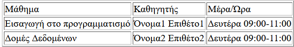

</div>
<div>

```html
<table>
  <tr>
    <td>Μάθημα</td>
    <td>Καθηγητής</td>
    <td>Μέρα/Ώρα</td>
  </tr>
  <tr>
    <td>Εισαγωγή στο προγραμματισμό</td>
    <td>Όνομα1 Επιθέτο1</td>
    <td>Δευτέρα 09:00-11:00</td>
  </tr>
    <tr>
      <td>Δομές Δεδομένων</td>
      <td>Όνομα2 Επιθέτο2</td>
      <td>Δευτέρα 09:00-11:00</td>
    </tr>
</table>
```
</div>
</div>

</div>

---

<!-- _class: rest -->

# Πίνακες (tables) (3/6)

<div class="container">

<div class="columns">
<div>

- Ετικέτα `<th>`, ορίζει μία κεφαλίδα του πίνακα 
- Ετικέτα `<caption>`, ορίζει τον τίτλο ενός πίνακα

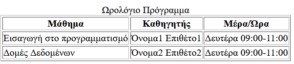

</div>
<div>

```html
<table>
  <caption>Ωρολόγιο Πρόγραμμα</caption>
    <tr>
      <th>Μάθημα</th>
      <th>Καθηγητής</th>
      <th>Μέρα/Ώρα</th>
    </tr>
    <tr>
      <td>Εισαγωγή στο προγραμματισμό</td>
      <td>Όνομα1 Επιθέτο1</td>
      <td>Δευτέρα 09:00-11:00</td>
    </tr>
    <tr>
      <td>Δομές Δεδομένων</td>
      <td>Όνομα2 Επιθέτο2</td>
      <td>Δευτέρα 09:00-11:00</td>
    </tr>
</table>
```
</div>
</div>

</div>

---

<!-- _class: rest -->

# Πίνακες (tables) (4/6)

<div class="container">

<div class="columns">
<div>

- Ετικέτα `<colgroup>`, προσδιορίζει μία ομάδα από μία ή περισσότερες στήλες του πίνακα για μορφοποίηση
- Ετικέτα `<col>`, προσδιορίζει ιδίοτητες για τις στήλες που βρίσκονται μέσα σε ένα colgroup

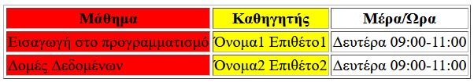

</div>
<div>

```html
<table>
  <colgroup>
    <col span="1" style="background-color:red">
    <col style="background-color:yellow">
  </colgroup>
  <tr>
    <th>Μάθημα</th>
    <th>Καθηγητής</th>
    <th>Μέρα/Ώρα</th>
  </tr>
  <tr>
    <td>Εισαγωγή στο προγραμματισμό</td>
    <td>Όνομα1 Επιθέτο1</td>
    <td>Δευτέρα 09:00-11:00</td>
  </tr>
  <tr>
    <td>Δομές Δεδομένων</td>
    <td>Όνομα2 Επιθέτο2</td>
    <td>Δευτέρα 09:00-11:00</td>
  </tr>
</table>
```
</div>
</div>

</div>

---

<!-- _class: rest -->

# Πίνακες (tables) (5/6)

<div class="container">

<div class="columns">
<div>

- Ετικέτα, `<thead>`, ομαδοποιεί τους header του πίνακα
- Ετικέτα `<tbody>`, ομαδοποιεί το κυρίως δεδομένα του πίνακα 
- Ετικέτα `<tfoot>`, ομαδοποιεί τα περιέχομενα του υποσέλιδου (footer) του πίνακα
- Οι ετικέτες `<thead>`, `<tbody>`,`<tfoot>` βοηθάνε στην μορφοποίηση των πινάκων

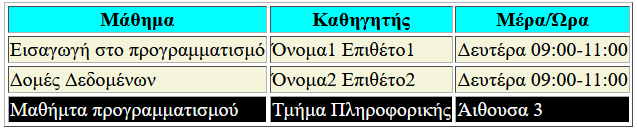

</div>
<div>

```html
<table>
  <thead>
    <tr>
      <th>Μάθημα</th>
      <th>Καθηγητής</th>
      <th>Μέρα/Ώρα</th>
    </tr>
  </thead>
  <tbody>
    <tr>
      <td>Εισαγωγή στο προγραμματισμό</td>
      <td>Όνομα1 Επιθέτο1</td>
      <td>Δευτέρα 09:00-11:00</td>
    </tr>
    <tr>
      <td>Δομές Δεδομένων</td>
      <td>Όνομα2 Επιθέτο2</td>
      <td>Δευτέρα 09:00-11:00</td>
    </tr>
  </tbody>
  <tfoot>
    <tr>
      <td>Μαθήματα προγραμματισμού</td>
      <td>Τμήμα Πληροφορικής</td>
      <td>Άιθουσα 3</td>
     </tr>
   </tfoot>
  </table>
```
</div>
</div>

</div>

---

<!-- _class: rest -->

# Πίνακες (tables) (6/6)

<div class="container">

<div class="columns">
<div>

- Ιδιότητα rowspan (`<td>`), αριθμός γραμμών που το κελί επεκτείνεται.
- Ιδιότητα colspan (`<td>`), αριθμός στηλών που το κελί επεκτείνεται.

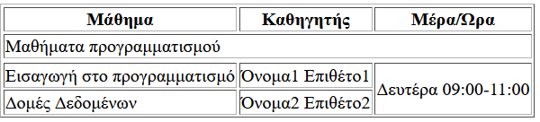

</div>
<div>

```html
<table>
  <thead>
    <tr>
      <th>Μάθημα</th>
      <th>Καθηγητής</th>
      <th>Μέρα/Ώρα</th>
    </tr>
  </thead>
  <tbody>
    <tr>
      <td colspan="3">Μαθήματα προγραμματισμού</td>
    </tr>
    <tr>
    <tr>
      <td>Εισαγωγή στο προγραμματισμό</td>
      <td>Όνομα1 Επιθέτο1</td>
      <td rowspan="2">Δευτέρα 09:00-11:00</td>
    </tr>
    <tr>
      <td>Δομές Δεδομένων</td>
      <td>Όνομα2 Επιθέτο2</td>
    </tr>
  </tbody>
</table>
```
</div>
</div>

</div>

---

<!-- _class: rest -->

# Λιστες ταξινομημένες και μη (ul,ol)

<div class="container">

<div class="columns">
<div>

- Οι **μη ταξινομημένες** html λίστες ξεκινάνε με την ετικέτα `<ul>`. Κάθε στοιχείο της λίστας ξεκινάει με την ετικέτα `<li>`.
- Μια **ταξινομημένη λίστα** ξεινάει με την ετικέτα `<ol>`. Κάθε στοιχείο της λίστας ξεκινάει με την ετικέτα `<li>`.
  - Ιδιότητα **reversed**, αναστρέφει την αρίθμηση της λίστας
 
</div>
<div>

```html
<h2>Μη ταξινομημένη λίστα</h2>
<ul>
  <li>HTML</li>
  <li>CSS</li>
  <li>JavaScript</li>
</ul>

<h2>Ταξινομημένη λίστα</h2>
<ol type="a" reversed>
  <li>HTML</li>
  <li>CSS</li>
  <li>JavaScript</li>
</ol>
```

</div>
</div>

- Ιδιότητα **start**, ορίζει τον αριθμό που ξεκινά η λίστα 	
- Ιδιότητα **type**, (1,A,a,I,i), ορίζει το τύπο της ταξινομημένης λίστας
</div>

---

<!-- _class: rest -->

# Λιστες περιγραφής (dl)

<div class="container">

<div class="columns">
<div>

- **Λίστες περιγραφής** είναι μια λίστα από όρους στην οποία κάθε όρος ακολουθείται και από περιγραφή.
- Η ετικέτα `<dl>`, δηλώνει την έναρξη της λίστας περιγραφής.
- Η ετικέτα `<dt>` χρησιμοποιείται για να δηλώσουμε το όνομα του όρου.
- Η ετικέτα `<dd>` χρησιμοποιείται για την περιγραφή του όρου.
 
</div>
<div>

```html
<h2>Λίστα περιγραφής</h2>
<dl>
  <dt>HTML</dt>
  <dd>
    Η HTML είναι το ακρωνύμιο των λέξεων HyperText Markup Language.
  </dd>
        
  <dt>CSS</dt>
  <dd>
    Η CSS, αρχικά των λέξεων Cascading Style Sheets (αλληλουχίες φύλλων στυλ).
  </dd>
</dl>
```

</div>
</div>

</div>

---

<!-- _class: rest -->

# Συνδυασμός από λίστες

<div class="container">

<div class="columns">
<div>

```html
<ul>
  <li>HTML
    <ol>
      <li>Tables</li>
      <li>Forms</li>
      <li>Images</li>
    </ol>
  </li>
  <li>CSS
    <ul>
      <li>Selectors/li>
      <li>Attributes</li>
    </ul>
  </li>
  <li>Javascript</li>
</ul>

```
 </div>
<div>

```html
<dl>
  <dt>HTML</dt>
  <dd>
    Η HTML είναι το ακρωνύμιο των λέξεων HyperText Markup Language.
    <ul>
      <li>Elements</li>
      <li>Attributes</li>
      <li>Events</li>
    </ul>
  </dd>
     
  <dt>CSS</dt>
  <dd>
    Η CSS, αρχικά των λέξεων Cascading Style Sheets αλληλουχίες φύλλων στυλ.
    <ul>
      <li>Syntax</li>
      <li>Selectors</li>
      <li>Comments</li>
    </ul>
  </dd>
 </dl>
```

</div>
</div>

</div>

---

<!-- _class: rest -->

# Εισαγωγή Εικόνας

<div class="container">

<div class="columns">
<div>

- Αφού αποκτήσουμε μια εικόνα σε μορφή GIF, JPEG η PNG, μπορούμε να τη συμπεριλάβουμε σε μια ιστοσελίδα. 
- Οι εικόνες υποδεικνύονται με την ετικέτα **`` (image)**, 

</div>
<div>

```html
<!DOCTYPE html>
<html lang="en">
<head>
    <meta charset="UTF-8">
    <meta http-equiv="X-UA-Compatible" content="IE=edge">
    <meta name="viewport" content="width=device-width, initial-scale=1.0">
    <title>Εισαγωγή Εικόνας</title>
</head>
<body>
    <p>
      
    </p>
</body>
</html>
```


</div>
</div>

- Η ετικέτα `` **δεν** έχει ετικέτα τέλους
- Ιδιότητα **src (source)**, που δείχνει το όνομα αρχείου ή το URL της εικόνας
- Ιδιότητα **width**, **height**, ορίζει πλάτος και ύψος εικόνας
- Ιδιότητα **alt**, εμφανίζει κείμενο σε περίπτωση που εικόνα δεν εμφανίζεται

</div>

---

<!-- _class: rest -->

# Φόρμες (forms)

<div class="container">

<div class="columns">
<div>

## Η λειτουργία μιας φόρμας

Όταν υποβάλλετε μια φόρμα, οι πληροφορίες που εισάγουμε μεταβιβάζονται από το πρόγραμμα περιήγησης στο διακομιστή.
Οι φόρμες είναι το "front-end" για τον  "HTTP Client"  που στέλνει πληροφορίες στον HTTP Server, το "back=end".

</div>
<div>

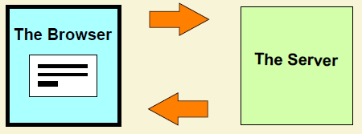
- Ο χρήστης συμπληρώνει μια φόρμα και την υποβάλλει
- Το πρόγραμμα περιήγησης στέλνει τα δεδομένα της φόρμας στο διακομιστή
- Ο διακομιστής λαμβάνει τα δεδομένα, τα επεξεργάζεται και στέλνει μια απάντηση
- Το πρόγραμμα περιήγησης εμφανίζει την απάντηση

</div>
</div>
</div>

---

<!-- _class: rest -->

# Φόρμες (forms)

<div class="container">

<div class="columns">
<div>

- Οι φόρμες μας δίνουν τη δυνατότητα να πάρουμε πληροφορίες από το χρήστη εισάγωντας δεδομένα. 
- Οι φόρμες ανοίγουν και κλείνουν με τις ετικέτες `<form> και </form>`
- Η ετικέτα `<input>` μαζί με την ιδιότητα **type** είναι αυτές που καθορίζουν το αντικείμενα ελέγχου της φόρμας που θα χρησιμοποιήσουμε. 

</div>
<div>

```html
<!DOCTYPE html>
<html lang="en">
<head>
    <meta charset="UTF-8">
    <meta http-equiv="X-UA-Compatible" content="IE=edge">
    <meta name="viewport" content="width=device-width, initial-scale=1.0">
    <title>Φόρμες</title>
</head>
<body>

<form>
  <input type="text" name="firstname"><br>
  <input type="text" name="lastname"><br>
</form>  
</body>
</html>
```
Τα αντικείμενα ελέγχου είναι: Radio Buttons, Check Boxes, Drop-Down List, Text Fields, Text Areas, Buttons

</div>
</div>
</div>

---

<!-- _class: rest -->

# Αντικείμενα ελέγχου φόρμας

<div class="container">

**Label**

Στην ετικέτα `<label>` καταχωρούμε τον τίτλο που έχουν τα αντικείμενα ελέγχου της φόρμας.
Η ετικέτα `<label>` είναι χρήσιμη για χρήστες με πρόγραμμα ανάγνωσης οθόνης, επειδή το πρόγραμμα ανάγνωσης οθόνης θα διαβάσει δυνατά την ετικέτα όταν ο χρήστης εστιάσει στο στοιχείο εισόδου.
Το στοιχείο <label> βοηθά επίσης τους χρήστες που δυσκολεύονται να κάνουν κλικ σε πολύ μικρές περιοχές (όπως κουμπιά επιλογής ή πλαίσια ελέγχου) - επειδή όταν ο χρήστης κάνει κλικ στο κείμενο μέσα στο στοιχείο `<label>`, επιλέγει το αντικείμενα ελέγχου της φόρμας.
Το χαρακτηριστικό `for` της ετικέτας `<label>` πρέπει να είναι ίσο με το χαρακτηριστικό `id` του στοιχείου `<input>` για να τα συνδέσει μεταξύ τους. 

</div>

---

<!-- _class: rest -->

# Αντικείμενα ελέγχου φόρμας

<div class="container">

<div class="columns">
<div>

**Radio Buttons**
Τα Κουμπιά Επιλογής δίνουν τη δυνατότητα στο χρήστη να διαλέξει μία επιλογή από τα διαθέσιμα κουμπιά.

```html
<form>
  <input type="radio" name="gender" value="male" id="male" checked>
  <label for="male">Άντρας</label><br>
  <input type="radio" name="gender" value="female" id="female"> 
  <label for="female">Γυναίκα</label><br>
  <input type="radio" name="gender" value="other" id="other">
  <label for="other">Άλλο</label> 
</form>
```
<form>
  <input type="radio" name="gender" value="male" id="male" checked>
  <label for="male">Άντρας</label><br>
  <input type="radio" name="gender" value="female" id="female"> 
  <label for="female">Γυναίκα</label><br>
  <input type="radio" name="gender" value="other" id="other">
  <label for="other">Άλλο</label>
</form>

</div>
<div>

**Check Βoxes**
Τα Κουμπιά Πολλαπλής Επιλογής δίνουν τη δυνατότητα στο χρήστη να διαλέξει παραπάνω από μία επιλογές από τα διαθέσιμα κουμπιά.

```html
<form>
 <input type="checkbox" name="vehicle1" value="Bike" id="bicycle">
 <label for="male">Ποδήλατο</label><br>
 <input type="checkbox" name="vehicle2" value="Motorcycle" id="motorcycle">
 <label for="motorcycle">Μοτοσυκλέτα</label><br>
 <input type="checkbox" name="vehicle3" value="Car" id="car">
 <label for="car">Αυτοκίνητο</label>
</form>
```
<form>
  <input type="checkbox" name="vehicle1" value="Bike" id="bicycle">
  <label for="male">Ποδήλατο</label><br>
  <input type="checkbox" name="vehicle2" value="Motorcycle" id="motorcycle">
  <label for="motorcycle">Μοτοσυκλέτα</label><br>
  <input type="checkbox" name="vehicle3" value="Car" id="car">
  <label for="car">Αυτοκίνητο</label>
</form>

</div>
</div>
</div>

---

<!-- _class: rest -->

# Αντικείμενα ελέγχου φόρμας

<div class="container">

<div class="columns">
<div>

**Drop-Down List**
Δίνουν τη δυνατότητα στο χρήστη να διαλέξει μία επιλογή από αυτήν.

```html
<form>
  <label for="nationality">Υπηκοότητα</label>
  <select name="language" id="nationality">
    <option value="Greek">Greek</option>
    <option value="English">English</option>
    <option value="Spanish">Spanish</option>
    <option value="Italian">Italian</option>
  </select>
</form>
```
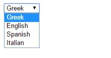
</div>
<div>

**Text Fields**
Τα πεδία κειμένων δίνουν τη δυνατότητα στο χρήστη να εισάγει κείμενο.

```html
<form>
  <label for="firstname">Όνομα:</label>
  <input type="text" name="firstname" id="firstname"><br>
  <label for="lastname">Επίθετο:</label>
  <input type="text" name="lastname" id="lastname"><br>
</form>
```
<form>
  <label for="firstname">Όνομα:</label>
  <input type="text" name="firstname" id="firstname"><br>
  <label for="lastname">Επίθετο:</label>
  <input type="text" name="lastname" id="lastname"><br>
</form>

</div>
</div>

</div>

---

<!-- _class: rest -->

# Αντικείμενα ελέγχου φόρμας

<div class="container">

<div class="columns">
<div>

**Text Areas**
Οι Περιοχές Κειμένων δίνουν και αυτές τη δυνατότητα στο χρήστη να εισάγει κείμενο αλλά το πλαίσιο της περιλαμβάνει περισσότερες γραμμές

```html
<form>
  <label for="message">Γράψτε εδώ το μήνυμά σας:</label><br>
  <textarea name="message" id="message" rows="10" cols="30"></textarea>
</form>
```
<form>
  <label for="message">Γράψτε εδώ το μήνυμά σας:</label><br>
  <textarea name="message" id="message" rows="5" cols="30"></textarea>
</form>

</div>
<div>

**Buttons**
Τo submit button δίνει τη δυνατότητα στο χρήστη, μόλις ολοκληρώσει τη συμπλήρωση των φορμών να στείλει τις πληροφορίες και η αναννέωση της σελίδας.

```html
<form>
  <label for="firstname">Όνομα:</label>
  <input type="text" name="firstname" id="firstname"><br>
  <input type="submit" value="Αποστολή">
</form>
```
<form>
  <label for="firstname">Όνομα:</label>
  <input type="text" name="firstname" id="firstname"><br>
  <input type="submit" value="Αποστολή">
</form>

</div>
</div>

</div>

---

<!-- _class: rest -->

# Άλλα στοιχεία φορμών 

<div class="container">

<diV class="columns">
<div>

 **Αντικείμενo ελέγχου Range**
 Ορίζει ένα στοιχείο ελέγχου για την εισαγωγή ενός αριθμού του οποίου η ακριβής τιμή δεν είναι σημαντική 

```html
<label for="age">Ηλικία:</label>
<input type="range" name="age" id="age" min="20" max="40" 
oninput="this.nextElementSibling.value = this.value">
<output name="ageOutputName" id="ageOutputId">30</output>
````

<label for="age">Ηλικία:</label>
<input type="range" name="age" id="age" min="20" max="40" oninput="this.nextElementSibling.value = this.value">
<output name="ageOutputName" id="ageOutputId">30</output>

</div>
<div>

- Ετικέτα `<fieldset>` και `<legend>`, χρησιμοποιούνται για να ομαδοποιήσουμε τα στοιχεία μιας φόρμας και να τους βάλουμε έναν τίτλο  

```html
<fieldset>
  <legend>Προσωπικά Στοιχεία</legend>
  <label for="firstname">Όνομα:</label>
  <input type="text" name="firstname" id="firstname"><br>
  <label for="lastname">Επίθετο:</label>
  <input type="text" name="lastname" id="lastname"><br>
</fieldset> 
```
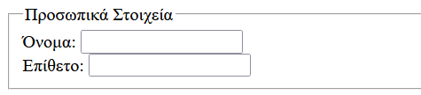

</div>
</div>

</div>

---

<!-- _class: rest -->

# Form attributes 

<div class="container">

- **name**: ορίζει το όνομα της φόρμας
- **action**: περιέχει το URL του αρχείου script στον Server το οποίο θα επεξεργαστεί τα στοιχεία της φόρμας
- **method**: καθορίζει τον τρόπο με τον οποίο στέλνονται τα δεδομένα της φόρμας στον server που βρίσκεται το πρόγραμμα script που θα τα επεξεργαστεί και μπορεί να πάρει τις τιμές get ή post

```html
<form name="myform" action="http://myserver/create" method="post">
...
</form>
```
</div>

---

<!-- _class: rest -->

# Input attributes 

<div class="container">

- **name**: κάθε πεδίο εισαγωγής πρέπει να έχει ένα χαρακτηριστικό όνομα- name για να υποβληθεί η τιμή του.
- **autofocus**: θα εμφανίσει την "εστίαση - focus" του δρομέα σε αυτό το πεδίο όταν φορτώνεται η σελίδα. 
- **value**: καθορίζει την αρχική τιμή για ένα πεδίο εισαγωγής.
- **placeholder**: ένα παράδειγμα ή μια σύντομη περιγραφή των πληροφοριών που θέλουμε να συμπληρώσει ο χρήστης.
- **minlength**: καθορίζει το ελάχιστο επιτρεπτό μήκος (πλήθος χαρακτήρων) για το πεδίο εισαγωγής.
- **maxlength**: καθορίζει το μέγιστο αριθμό χαρακτήρων που επιτρέπονται στο πεδίο εισαγωγής.

</div>

---

<!-- _class: rest -->

# Input attributes 

<div class="container">

- **readonly**: καθορίζει ότι το πεδίο εισαγωγής είναι read-only.
- **disabled**: απενεργοποιεί το πεδίο εισαγωγής
- **size**: καθορίζει το πλάτος του όταν εμφανίζεται στην οθόνη. 
- **required**: ορίζει ότι πρέπει να συμπληρωθεί υποχρεωτικά ένα πεδίο εισαγωγής πριν από την υποβολή της φόρμας.
- **min** και **max**: καθορίζει την ελάχιστη και τη μέγιστη τιμή που μπορεί να πάρει το πεδίο εισαγωγής.
- **pattern**, ορίζει μια regular expression βασή της οποίας ελέγχεται η τιμή του πεδίου εισαγωγής.
- **step**: ορίζει τα διαστηματα τα οποία επιτρέπονται σε ένα πεδίο εισαγωγής.
</div>

</div>

---

<!-- _class: rest -->

# Input type attributes 

<div class="container">

<div class="columns">
<div>

 - `<input type="button">`
- `<input type="checkbox">`
- `<input type="color">`
- `<input type="date">`
- `<input type="datetime-local">`
- `<input type="email">`
- `<input type="file">`
- `<input type="hidden">`
- `<input type="image">`
- `<input type="month">`
- `<input type="number">`

</div>
<div>

- `<input type="password">`
- `<input type="radio">`
- `<input type="range">`
- `<input type="reset">`
- `<input type="search">`
- `<input type="submit">`
- `<input type="tel">`
- `<input type="text">`
- `<input type="time">`
- `<input type="url">`
- `<input type="week">`
</div>
</div>

</div>

---

<!-- _class: rest -->

# Form Validation 

<div class="container">
Δυνατότητα επικύρωσης των δεδομένων χρήστη χωρίς να βασίζεται σε ελέγχους με JavaScript ή στο server (back-end). 

- **min** και **max**: καθορίζει την ελάχιστη και τη μέγιστη τιμή που μπορεί να πάρει το πεδίο εισαγωγής.
- **minlength**: καθορίζει το ελάχιστο επιτρεπτό μήκος (πλήθος χαρακτήρων) για το πεδίο εισαγωγής.
- **maxlength**: καθορίζει το μέγιστο αριθμό χαρακτήρων που επιτρέπονται στο πεδίο εισαγωγής.
- **required**: ορίζει ότι πρέπει να συμπληρωθεί υποχρεωτικά ένα πεδίο.
- **pattern**: ορίζει μια regular expression και ελέγχεται η τιμή του πεδίου εισαγωγής.
- **type**: στη περίπτωση που τα πεδία είναι τύπου number, email address ή άλλο συγκεκριμένο προκαθορισμένο τύπο πεδίο.

</div>

---

<!-- _class: rest -->

# Εισαγωγή βίντεο

<div class="container">

<div class="columns">
<div>

- Εισαγωγή βίντεο με την **ετικέτα video**  
- Η ετικέτα video περιλαμβάνει ιδιότητες που καθορίζουν στοιχεία όπως το μέγεθος του βίντεο, το αν θα παρέχονται πλήκτρα ελέγχου όπως έλεγχος έντασης ήχου και διακοπής της αναπαραγωγής.

```html
 <video width="320" height="240" controls>
  <source src="mymovie.mp4" type="video/mp4">
  <source src="mymovie.mp3" type="video/mp3">
Δυστυχώς δεν υποστηρίζεται η ετικέτα video!
</video> 
```

</div>
<div>

```html
<!DOCTYPE html>
<html lang="en">
<head>
    <meta charset="UTF-8">
    <meta http-equiv="X-UA-Compatible" content="IE=edge">
    <meta name="viewport" content="width=device-width, initial-scale=1.0">
    <title>Εισαγωγή βίντεο</title>
</head>
<body>
    <video  src="myvideo.mp4"  width="320" height="240"  controls></video>
</body>
</html>
```
- ιδιότητα **src** που περιέχει τη διεύθυνση του αρχείου βίντεο
- ιδιότητες **width** και **height** για τον ορισμό των διαστάσεων
- ιδιότητα **controls** για την εμφάνιση των στοιχείων ελέγχου

</div>
</div>

</div>

---

<!-- _class: rest -->

# Εισαγωγή ήχου

<div class="container">

<div class="columns">
<div>

- Εισαγωγή ήχου με την **ετικέτα audio**  
- Η ετικέτα audio περιλαμβάνει ιδιότητες που καθορίζουν στοιχεία όπως το τύπο του αρχείου ήχου
- Παρέχεται το ίδιο αρχείο ήχου σε δύο μορφές (mp3 και ogg), ώστε το πρόγραμμα πλοήγησης να επιλέξει το πιο κατάλληλο
 
</div>
<div>

```html
<audio controls>
  <source src="ixos.mp3" type="audio/mpeg" />
  <source src="ixos.ogg" type="audio/ogg" />
  Δυστυχώς δεν υποστηρίζεται η ετικέτα audio!
</audio>
```
- Κάθε εναλλακτικό αρχείο ήχου εμπεριέχεται σε εμφωλευμένη ετικέτα <source>
- Παρέχεται μήνυμα λάθους («Δυστυχώς δεν … audio!») στην περίπτωση που δεν μπορεί να γίνει αναπαραγωγή του ήχου
</div>
</div>

</div>

---

<!-- _class: rest -->

# Scalable Vector Graphics (SVG)

<div class="container">

Element της HTML που επιτρέπει τη δημιουργία σχημάτων με χρήση διανυσματικών γραφικών σε XML μορφή

<div class="columns">
<div>

```html
<svg width="100" height="100">
  <circle cx="50" cy="50" r="40" stroke="green" stroke-width="4" fill="yellow" />
</svg>
```
<svg width="100" height="100">
  <circle cx="50" cy="50" r="40" stroke="green" stroke-width="4" fill="yellow" />
</svg>

```html
<svg width="400" height="100">
  <rect width="400" height="100" style="fill:rgb(0,0,255);stroke-width:10;stroke:rgb(0,0,0)" />
</svg>
```

<svg width="200" height="50">
  <rect width="200" height="50" style="fill:rgb(0,0,255);stroke-width:10;stroke:rgb(0,0,0)" />
</svg>

</div>
<div>

```html
<svg width="400" height="180">
  <rect x="50" y="20" rx="20" ry="20" width="150" height="150"
  style="fill:red;stroke:black;stroke-width:5;opacity:0.5" />
</svg>
```
<svg width="400" height="180">
  <rect x="50" y="20" rx="20" ry="20" width="150" height="150"
  style="fill:red;stroke:black;stroke-width:5;opacity:0.5" />
</svg>

</div>
</div>

</div>

---

<!-- _class: rest -->

# Canvas

<div class="container">

Μπορούμε να σχεδιάσουμε σχήματα και γραμμές, κείμενο και καμπύλες, αποχρώσεις και μοτίβα καθώς και να επεξεργαστούμε pixels σε εικόνες και video με χρήση Javascript

```html
<canvas id="myCanvas" width="150" height="150"></canvas>
```
```javascript
var canvas = document.getElementById('myCanvas');
var ctx = canvas.getContext('2d');
ctx.fillStyle = "rgb(200,0,0)";
ctx.fillRect (10, 10, 55, 50);
ctx.fillStyle = "rgba(0, 0, 200, 0.5)";
ctx.fillRect (30, 30, 55, 50);
```


</div>

---

<!-- _class: rest -->

# Iframe

<div class="container">

Το  iframe χρησιμοποιείται για την εμφάνιση μιας ιστοσελίδας μέσα σε μια ιστοσελίδα.

```html
<iframe src="10-svg.html" height="200" width="300" title="Iframe Example"></iframe>
  
  <iframe id="inlineFrameExample"
    title="Inline Frame Example"
    width="300"
    height="200"
    src="https://www.openstreetmap.org/export/embed.html?bbox=-0.004017949104309083%2C51.47612752641776%2C0.00030577182769775396%2C51.478569861898606&layer=mapnik">
  </iframe>
```
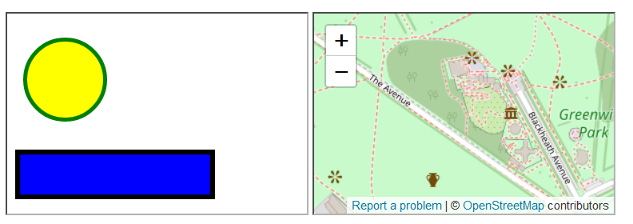

</div>

---

<!-- _class: rest -->

# Άλλα HTML5 elements

<div class="container">

- `<nav>`: η ετικέτα `<nav>` ορίζει ένα σύνολο συνδέσμων πλοήγησης.
- `<header>`: δεν είναι επικεφαλίδα μιας ιστοσελίδας απλά, το `<header>` μπορεί να χρησιμοποιηθεί σαν επικεφαλίδα ενός blog, άρθρου κλπ
- `<article>`: η ετικέτα `<article>` καθορίζει ανεξάρτητο, αυτόνομο περιεχόμενο.
- `<footer>`: η ετικέτα `<footer>` ορίζει ένα υποσέλιδο για ένα έγγραφο ή ενότητα
- `<progress>` : μετρητής προόδου 
- `<meter>`: η ετικέτα `<meter>` ορίζει μια βαθμωτή μέτρηση σε ένα γνωστό εύρος ή μια κλασματική τιμή. 
- `<section>`: η ετικέτα `<section>` ορίζει μια ενότητα σε ένα έγγραφο.

</div>

---

<!-- _class: rest -->

# WebStorage

<div class="container">

Οι web εφαρμογές μπορούν να αποθηκεύουν δεδομένα τοπικά μέσα στο browser του χρήστη.

- Πριν από την HTML5, τα δεδομένα της εφαρμογής έπρεπε να αποθηκεύονται σε cookies 
- To Web storage είναι πιο ασφαλή και μεγάλος όγκος δεδομένων μπορεί να αποθηκευτεί τοπικά, χωρίς να επηρεάζεται η απόδοση του ιστότοπου.
- Σε αντίθεση με τα cookies, το όριο αποθήκευσης είναι πολύ μεγαλύτερο (τουλάχιστον 5 MB) και οι πληροφορίες δεν μεταφέρονται ποτέ στον διακομιστή.

```javascript
// Store
localStorage.setItem("lastname", "Smith");

// Retrieve
document.getElementById("result").innerHTML = localStorage.getItem("lastname");
```

---

<!-- _class: rest -->

# Semantics elements

<div class="container">

- Semantics elements = στοιχεία με νόημα.
- Τα semantic elements περιγράφουν ξεκάθαρα το νόημά του τόσο για το πρόγραμμα περιήγησης όσο και για τον προγραμματιστή.
- Τα μη σημασιολογικά στοιχεία: `<div>` και `<span>` δεν αναφέρουν κάτι για το περιεχόμενό τους.
- Τα σημασιολογικά στοιχεία: `<form>`, `<table>` και `<article>` καθορίζουν ξεκάθαρα το περιεχόμενό τους.
- Στην HTML5 υπάρχουν αρκετά σημασιολογικά στοιχεία όπως: `<article>`, `<aside>`, `<details>`, `<figcaption>`, `<figure>`, `<footer>`, `<header>`, `<main>`, `<mark>`, `<nav>`, `<section>`, `<summary>`, `<time>` κ.α

</div>

---

<!-- _class: rest -->

# Δομή σελίδας με την HTML5

<div class="container">

## Κάνοντας ένα blog με την html5

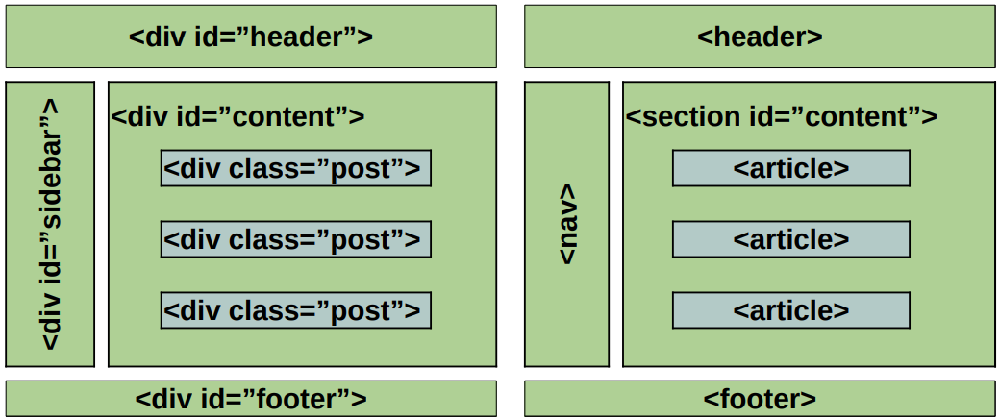

</div>