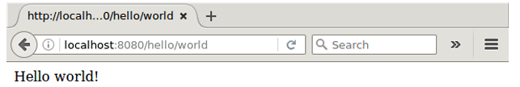
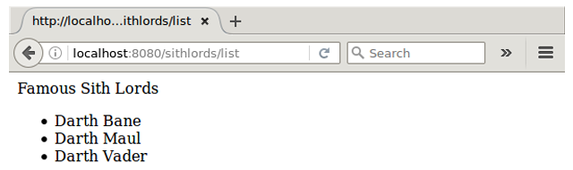
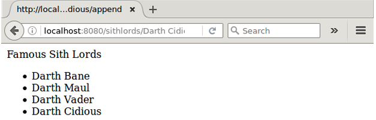
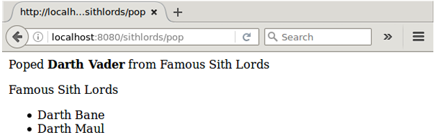
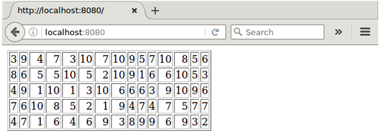
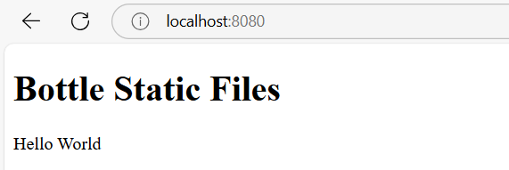
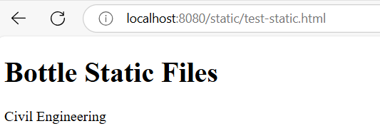
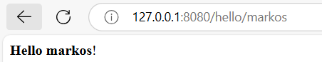
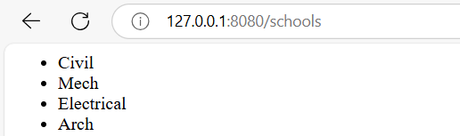
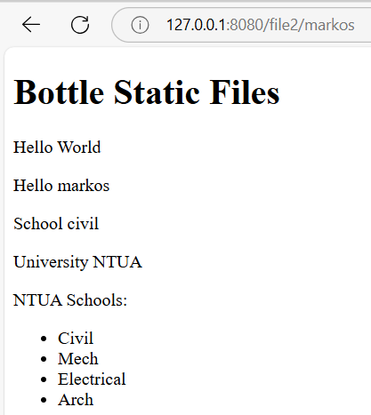

<!-- _class: lead -->


# Σχολή Πολιτικών Μηχανικών
## Μέθοδοι Επίλυσης με Η/Υ

**Καθ. Νίκος Λαγαρός** (nlagaros@central.ntua.gr)
**Δρ. Αθανάσιος Στάμος ΕΔΙΠ** (stamthan@central.ntua.gr)
**Μάρκος Καραμπάτσης ΕΔΙΠ** (marka@mail.ntua.gr)
**Δρ. Χριστόδουλος Φραγκουδάκης ΕΔΙΠ** (chfrag@mail.ntua.gr)


---

<!-- _class: rest -->

# Python Web Programming

<div class="container">

Η Python από την 1η έκδοση υποστηρίζει δικτυακές εφαρμογές
Στην πρότυπη βιβλιοθήκη υπάρχουν κλάσεις που υλοποιούν διακομιστή (web server):
```python
from http.server import HTTPServer, SimpleHTTPRequestHandler
server_address = ('', 8080)
myserver = HTTPServer(server_address, SimpleHTTPRequestHandler)
myserver.serve_forever()
```
Ο διακομιστής που δημιουργείται δείχνει τα αρχεία που βρίσκονται στον τρέχοντα φάκελο
H διεύθυνση είναι **127.0.0.1 (localhost)** και η θύρα (port number) είναι **8080**. Μπορούμε να δούμε την ιστοσελίδα στη διεύθυνση: http://127.0.0.1:8080 (ή http://localhost:8080)

</div>

---

<!-- _class: rest -->

# Python Web Programming

<div class="container">

Το πρόγραμμα Hello world με την πρότυπη βιβλιοθήκη

```python
from http.server import BaseHTTPRequestHandler, HTTPServer

class HelloWorldHandler(BaseHTTPRequestHandler):
  
  def do_GET(self):
    self.send_response(200) # Send HTTP status code 200 (OK)
    self.send_header('Content-type', 'text/html') # Send headers
    self.end_headers()
    self.wfile.write(b"Hello, World!") # Send the response body

# Server settings
host = "localhost"
port = 8000

# Create and start the server
with HTTPServer((host, port), HelloWorldHandler) as server:
  print(f"Serving on http://{host}:{port}")
  server.serve_forever()
```
<!-- http://localhost:8000/ -->

</div>

---

<!-- _class: rest -->

# Python Web Programming

<div class="container">

- Η πρότυπη βιβιοθήκη είναι λίγο δυσχερής στη χρήση
- Υπάρχουν εξωτερικές βιβλιοθήκες:
  - bottle: χρησιμοποιεί την πρότυπη βιβλιοθήκη, είναι απλή και γρήγορη, για μικρές εφαρμογές ιστού
  - flask: πιο προχωρημένη και αξιόπιστη, για μεσαίες εφαρμογες ιστού
  - django: πολύ προχωρημένη και αξιόπιστη, για μεγαλύτερες εφαρμογές ιστού
- Και πολλές άλλες..
- Για εκπαιδευτικούς λόγους θα χρησιμοποιήσουμε την bottle

</div>

---

<!-- _class: rest -->

# Python Web Programming

<div class="container">

Το πρόγραμμα Hello world
<div class="columns">
<div>

```python
from bottle import route, run

@route('/hello/world')
def index():
return 'Hello world!'

run(host='localhost', port=8080)
```
</div>
<div>


</div>
</div>
</div>

---

<!-- _class: rest -->

# Python Web Programming

<div class="container">
<div class="columns">
<div>

```python
from bottle import route, run

sithlords = ['Darth Bane', 'Darth Maul', 'Darth Vader']

@route('/sithlords/list')
def index():
  listoflords = ['<li>' + lord + '</li>' for lord in sithlords ]
  html = 'Famous Sith Lords <br> <ul>' + ''.join(listoflords) + '</ul>'
  return html

run(host='localhost', port=8080)
```
</div>
<div>


</div>
</div>
</div>

---

<!-- _class: rest -->

# Python Web Programming

<div class="container">
<div class="columns">
<div>

```python
from bottle import route, run

sithlords = ['Darth Bane', 'Darth Maul', 'Darth Vader']

@route('/sithlords/<lord>/append')
def index(lord):
  sithlords.append(lord)
  listoflords = ['<li>' + lord + '</li>' for lord in sithlords ]
  html = 'Famous Sith Lords <br> <ul>' + ''.join(listoflords) + '</ul>'
  return html

run(host='localhost', port=8080)
```
</div>
<div>


</div>
</div>
</div>

---

<!-- _class: rest -->

# Python Web Programming

<div class=container>

<div class="columns">
<div>

```python
from bottle import route, run

sithlords = ['Darth Bane', 'Darth Maul', 'Darth Vader']

@route('/sithlords/pop')

def index():
  lord = sithlords.pop()
  html = '<p>Poped <b>' + lord +'</b> from Famous Sith Lords</p>'
  listoflords = ['<li>' + lord + '</li>' for lord in sithlords ]
  html += 'Famous Sith Lords <br> <ul>' + ''.join(listoflords) + '</ul>'
  return html

run(host='localhost', port=8080)
```
</div>
<div>


</div>
</div>
</div>

---

<!-- _class: rest -->

# Python Web Programming

<div class=container>
<div class="columns">
<div>

```python
from bottle import route, run
from random import random

@route('/')
def index():
  array = [[int(random()*10+1) for i in range(15)] for j in range(5)]
  html = '<table border=1>'
  for row in array:
    html += '<tr>'
    for element in row:
      html += '<td align=right>' + str(element) + '</td>'
    html += '</tr>'
  return html
          
run(host='localhost', port=8080)
```
</div>
<div>


</div>
</div>
</div>

---

<!-- _class: rest -->

# Python Web Programming

<div class=container>
<div class="columns">
<div>

```python
from bottle import get, run, template, static_file, debug

@get('/')
def index(name='World'):
  # return "I/O I/O it's off to hack we go"
  return template('test.html')

@get('/static/<filename:path>')
def get_static(filename):
  print(filename)
  return static_file(filename, root='static')

debug(mode=True)
run(host='localhost', port=8080, reloader=True)
```
</div>
<div>




</div>
</div>
</div>

---

<!-- _class: rest -->

# Python Web Programming

<div class=container>
<div class="columns">
<div>

```python
from bottle import route, run, template

@route('/hello/<name>')
def get_hello(name):
  return template('<b>Hello {{name}}</b>!', name=name)
# http://127.0.0.1:8080/hello/markos

@route('/schools')
def get_schools():
  schools = ['Civil', 'Mech', 'Electrical', 'Arch']
  html = '<ul>'
  for school in schools:
    html += '<li>' + school + '</li>'
  html += '</ul>'
  return html

@route('/file2/<name>')
def show_template(name):
  university = 'NTUA'
  schools = ['Civil', 'Mech', 'Electrical', 'Arch']
  return template('file2.html', name=name, school='civil', university=university, schools=schools)
# http://127.0.0.1:8080/file2/markos

run(host='localhost', port=8080)
```


</div>
<div>




</div>
</div>
</div>
